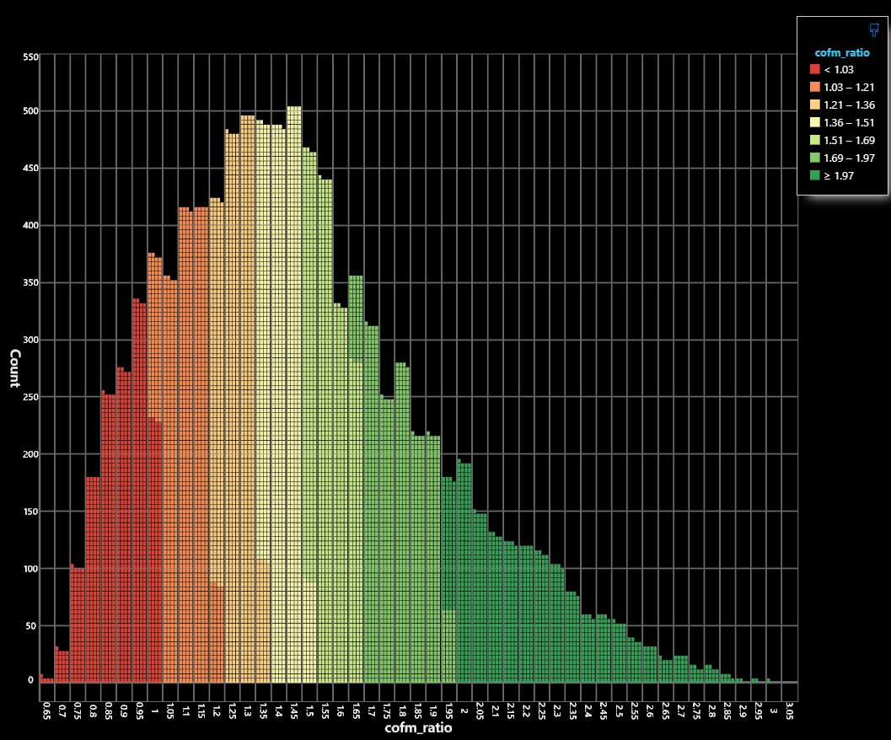

# COFMsim
Stochastic Correlation of Forces and Means Simulator.

## What is COFMsim

COFMsim is a tool that runs [Monte Carlo simulations](https://en.wikipedia.org/wiki/Monte_Carlo_method) for a given military operation, based on predefined force parameters. The user specifies these in a scenario file and COFMsim runs simulations using the [Correlations Of Forces and Means (COFM) methodology](https://www.rand.org/pubs/research_reports/RR4235.html). In stead of providing one specific Q value (correlation), it provides a probability that the attacker (red) beats the defender (blue) based on a user defined Q threshold, with a user defined amount of Monte Carlo simulations and Q threshold.

## Configuraiton

Example scenario file:

```toml
[simulation]
iterations = 10000
description = "Evaluates the probability of PLAN SAG forcing passage through a US blockade of Hormuz."
success_threshold = 1.1

[force_red]
name = "PLAN Far-Seas Task Force & Iranian Littoral Assets"
m_min = 0.8           # Lower bound of Environmental Multiplier
m_max = 1.6           # Upper bound of Environmental Multiplier
k_variance = 0.10     # 10% variance in unit quality

    [[force_red.units]]
    name = "Type 055 Destroyer (Renhai-class)"
    quantity = 2
    base_quality = 1.0  # Baseline reference asset

    [[force_red.units]]
    name = "Type 052D Destroyer (Luyang III-class)"
    quantity = 4
    base_quality = 0.8

    [[force_red.units]]
    name = "Type 054B Frigate (Jiangkai III-class)"
    quantity = 2
    base_quality = 0.65

    [[force_red.units]]
    name = "Iranian Integrated Coastal A2/AD Battery"
    quantity = 1
    base_quality = 0.7

    [[force_red.units]]
    name = "Type 093B SSN (Shang-class)"
    quantity = 1
    base_quality = 0.85

[force_blue]
name = "US Fleet Assets"
m_min = 0.6           # Lower bound of Environmental Multiplier
m_max = 1.2           # Upper bound of Environmental Multiplier
k_variance = 0.10     # 10% Intelligence Uncertainty

    [[force_blue.units]]
    name = "Arleigh Burke DDG (Persian Gulf)"
    quantity = 2
    base_quality = 0.9

    [[force_blue.units]]
    name = "Arleigh Burke DDG (Gulf of Oman)"
    quantity = 4
    base_quality = 0.9

    [[force_blue.units]]
    name = "Carrier Strike Group Air Wing (F/A-18 & F-35C)"
    quantity = 1  # Modeled as a single aggregate operational unit
    base_quality = 1.0

    [[force_blue.units]]
    name = "Virginia-class SSN"
    quantity = 1
    base_quality = 1.1
```

Under `[simulation]` the amount of simulations, a description and a Q threshold are described. The Q threshold determines whether a correlation constitutes a successful operation (by the attacker).

Each force also has a name, environmental multiplier M and a given uncertainty for K. The M value is randomly selected during each simulation and the K variance applies a percentage + and - upon each unit's base quality.

## Usage

```
          /$$$$$$   /$$$$$$  /$$$$$$$$ /$$      /$$           /$$
         /$$__  $$ /$$__  $$| $$_____/| $$$    /$$$          |__/
        | $$  \__/| $$  \ $$| $$      | $$$$  /$$$$  /$$$$$$$ /$$ /$$$$$$/$$$$
        | $$      | $$  | $$| $$$$$   | $$ $$/$$ $$ /$$_____/| $$| $$_  $$_  $$
        | $$      | $$  | $$| $$__/   | $$  $$$| $$|  $$$$$$ | $$| $$ \ $$ \ $$
        | $$    $$| $$  | $$| $$      | $$\  $ | $$ \____  $$| $$| $$ | $$ | $$
        |  $$$$$$/|  $$$$$$/| $$      | $$ \/  | $$ /$$$$$$$/| $$| $$ | $$ | $$
        \______/  \______/ |__/      |__/     |__/|_______/ |__/|__/ |__/ |__/

        Stochastic Correlation of Forces and Means Simulator.

Usage: cofmsim [OPTIONS] [scenario]

Arguments:
  [scenario]  Path to the scenario file. [default: scenario.toml]

Options:
  -o, --output <output>  Path to the output file. Example: ./output.csv
  -h, --help             Print help
  -V, --version          Print version
```

Cofmsim can be run without arguments and will only print a table:

```bash
$ cofmsim
------------------------------------------------------------------------------
Scenario: Evaluates the probability of PLAN SAG forcing passage through a US blockade of Hormuz.
Success threshold: 1.1
------------------------------------------------------------------------------

 ITERATIONS  SUCCESS COUNT  SUCCESS %
 10000       8021           80.21
```

Cofmsim can also be run with the `-o` option, which outputs the results of the battle for each simulation to a `.csv` file:

```bash
$ cofmsim -o output.csv
...
$ cat output.csv
iteration,red_env,red_quality,blue_env,blue_quality,red_total_force,blue_total_force,cofm_ratio,win_side
0,0.90272284,7.9356184,1.0544153,7.2158713,7.163664,7.6085253,0.94,BLUE
1,1.3401346,7.9496145,0.8483275,7.5575624,10.653554,6.4112883,1.66,RED
2,0.8820734,7.7837906,0.89543927,7.9025826,6.865875,7.076283,0.97,BLUE
3,1.0447856,8.369499,1.1520641,7.0382915,8.744332,8.108562,1.08,BLUE
4,0.8332073,8.082886,0.85714865,7.364672,6.7347193,6.3126187,1.07,BLUE
5,0.8484668,8.481805,0.90865254,7.725404,7.19653,7.0197077,1.03,BLUE
6,0.91250134,8.411398,0.8323214,7.2231693,7.6754117,6.0119987,1.28,RED
7,0.9304848,8.165981,0.8565527,7.1097775,7.5983214,6.089899,1.25,RED
8,1.0822307,8.242065,0.68304396,7.4255767,8.919816,5.0719953,1.76,RED
9,0.9858538,8.177308,1.1120787,7.271338,8.06163,8.0863,1.0,BLUE
10,1.3928205,7.6568675,1.000618,7.3150806,10.664641,7.319601,1.46,RED
...
```

When using the `-o` option, the system spawns a background thread that writes the results to disk asynchronously. When running extremely large amounts of simulations, it might take a while for your system to write all the results to your file system after the simulations have finished.

The `.csv` file can then be opened in a tool like [SandDance for VSCode](https://marketplace.visualstudio.com/items?itemName=msrvida.vscode-sanddance) to visualize the results:

